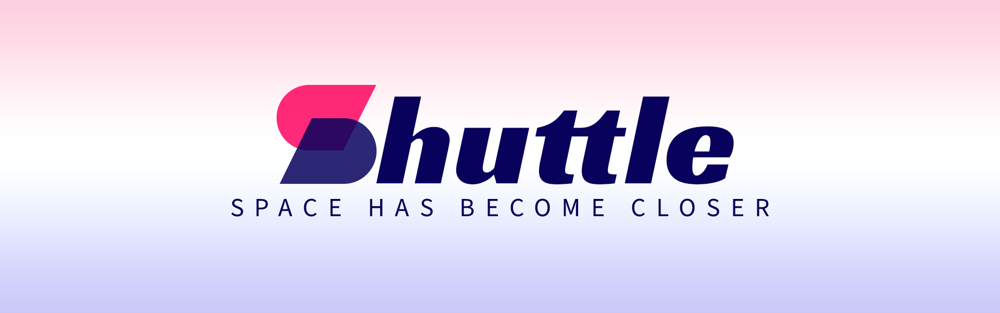

# Добро пожаловать в репозиторий "Shuttle"

## Описание

Этот проект представляет собой ASP.NET API для заказа и управления космическими полетами до различных планет Солнечной системы.

## Технологии

- ASP.NET Core для разработки API
- Entity Framework Core для работы с базой данных PostgreSQL
- RabbitMQ для обмена сообщениями между микросервисами
- NLog для логгирования событий

## Установка

1. Клонируйте репозиторий на свой локальный компьютер.
2. Убедитесь, что у вас установлены [.NET Core SDK](https://dotnet.microsoft.com/download) и [Docker](https://www.docker.com/).
3. Запустите контейнеры для баз данных PostgreSQL с помощью `docker-compose up -d`.

## Запуск

1. Перейдите в папку каждого микросервиса и выполните команду `dotnet run`.
2. Микросервисы будут доступны по адресам `http://localhost:5000`, `http://localhost:5001`, и так далее.

## Использование

- Откройте браузер или используйте инструменты для отправки HTTP-запросов (например, Postman).
- Пройдите аутентификацию, если требуется, и начните создавать заказы, управлять полетами и т. д.

## Вклад

Вы можете внести свой вклад в проект, создавая новые фичи, исправляя баги или улучшая существующий код. 

Прочтите [contributing.md](contributing.md) для получения дополнительной информации о том, как внести свой вклад.
